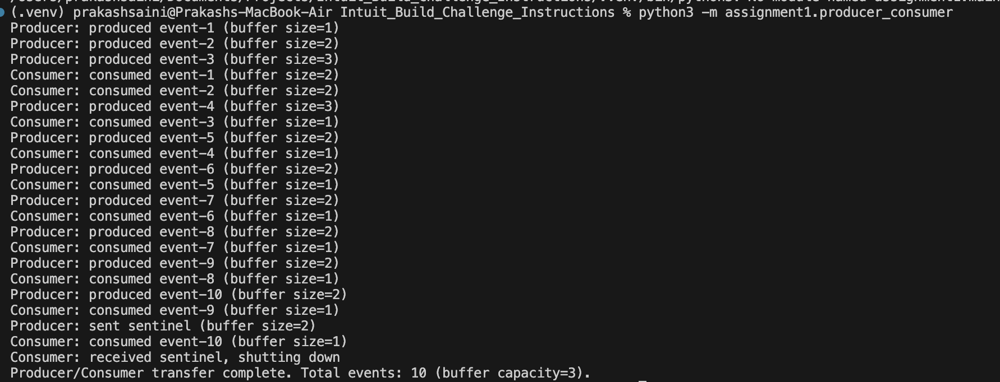
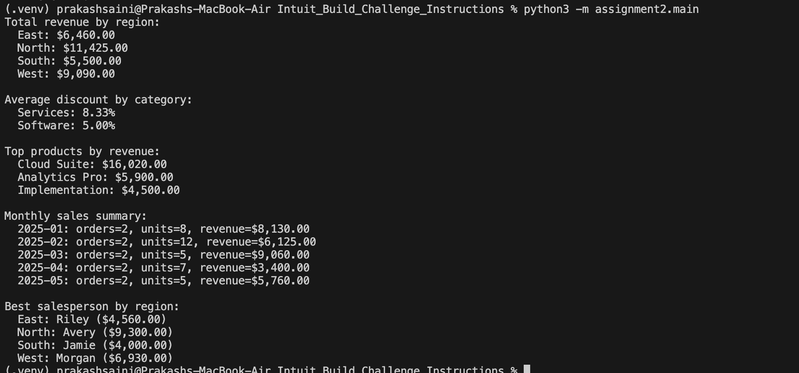
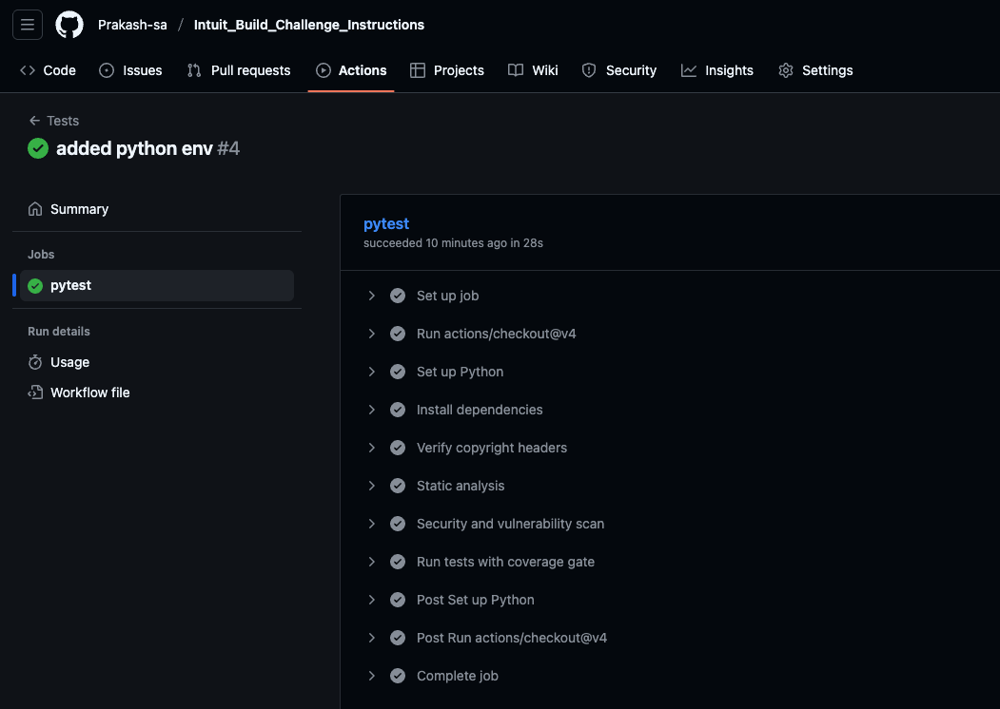
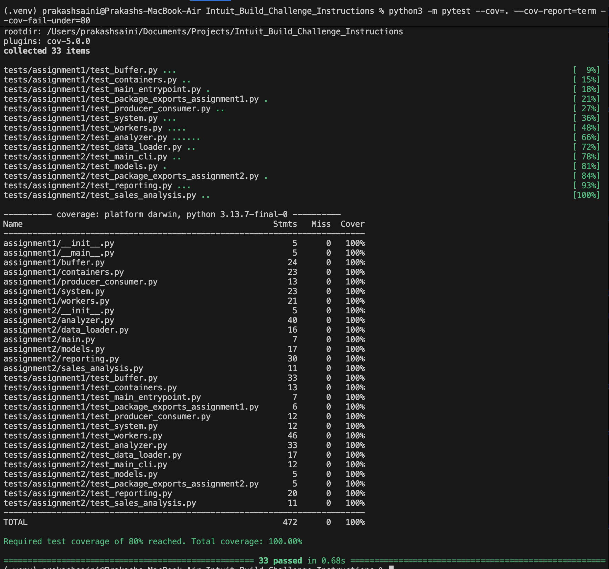

# Intuit Build Challenge (Python)

Production-ready implementations of the two required assignments, built with Python 3.11+, automated testing, and a hardened CI pipeline.

---

## At a Glance

| Assignment | Focus | Key Modules |
|-----------|-------|-------------|
| Assignment 1 | Concurrent producer/consumer pipeline | `containers.py`, `buffer.py`, `workers.py`, `system.py` |
| Assignment 2 | CSV-driven sales analytics | `models.py`, `data_loader.py`, `analyzer.py`, `reporting.py` |

Additional folders:

- `tests/` – Mirrored module-level pytest suites (100 % coverage).
- `scripts/` – Support tooling (e.g., copyright enforcement).
- `Dockerfile` & `docker-compose.yml` – Containerized demos/tests.
- `CONTRIBUTING.md` – Coding standards and contributor workflow.

---

## Getting Started

1. **Install dependencies**
   ```bash
   python3 -m venv .venv
   source .venv/bin/activate
   pip install -r requirements.txt
   ```
2. **Verify headers (policy gate)**
   ```bash
   python3 scripts/check_copyright.py
   ```
3. **Run Assignment 1 demo**
   ```bash
   python3 -m assignment1.producer_consumer
   ```
4. **Run Assignment 2 analytics**
   ```bash
   python3 -m assignment2.main
   ```
   The CLI wires `CSVSalesLoader` → `SalesAnalyzer` → `SalesReport` to produce the console summary.

> **Tip:** Running tests outside the repo root? Prefix commands with `PYTHONPATH=.` so the packages resolve.

---

## Docker & Compose

| Command | Description |
|---------|-------------|
| `docker compose build` | Build the shared image. |
| `docker compose run --rm assignment1-demo` | Run the producer/consumer showcase. |
| `docker compose run --rm assignment2-report` | Generate the sales report end-to-end. |
| `docker compose run --rm tests` | Execute pytest with coverage inside the container. |

---

## Testing & Quality Gates

### Core tests
```bash
python3 -m pytest
python3 -m pytest --cov=. --cov-report=term --cov-fail-under=80
```

### Static analysis & security
```bash
ruff check . && ruff format --check .
mypy assignment1 assignment2
bandit -r assignment1 assignment2
pip-audit -r requirements.txt
```

### What the suites cover
- Assignment 1: buffer blocking semantics, container contracts, worker coordination, CLI entry points.
- Assignment 2: CSV ingestion, analytical aggregations, reporting façade, legacy compatibility layer.

---

## Sample Assignment 1 Output

```
Producer: produced event-1 (buffer size=1)
Producer: produced event-2 (buffer size=2)
Producer: produced event-3 (buffer size=3)
Consumer: consumed event-1 (buffer size=2)
Consumer: consumed event-2 (buffer size=2)
Producer: produced event-4 (buffer size=3)
Consumer: consumed event-3 (buffer size=1)
Producer: produced event-5 (buffer size=2)
Consumer: consumed event-4 (buffer size=1)
Producer: produced event-6 (buffer size=2)
Consumer: consumed event-5 (buffer size=1)
Producer: produced event-7 (buffer size=2)
Consumer: consumed event-6 (buffer size=1)
Producer: produced event-8 (buffer size=2)
Consumer: consumed event-7 (buffer size=1)
Producer: produced event-9 (buffer size=2)
Consumer: consumed event-8 (buffer size=1)
Producer: produced event-10 (buffer size=2)
Consumer: consumed event-9 (buffer size=1)
Producer: sent sentinel (buffer size=2)
Consumer: consumed event-10 (buffer size=1)
Consumer: received sentinel, shutting down
Producer/Consumer transfer complete. Total events: 10 (buffer capacity=3).
```

## Sample Assignment 2 Output

```
Total revenue by region:
  East: $6,460.00
  North: $11,425.00
  South: $5,500.00
  West: $9,090.00

Average discount by category:
  Services: 8.33%
  Software: 5.00%

Top products by revenue:
  Cloud Suite: $16,020.00
  Analytics Pro: $5,900.00
  Implementation: $4,500.00

Monthly sales summary:
  2025-01: orders=2, units=8, revenue=$8,130.00
  2025-02: orders=2, units=12, revenue=$6,125.00
  2025-03: orders=2, units=5, revenue=$9,060.00
  2025-04: orders=2, units=7, revenue=$3,400.00
  2025-05: orders=2, units=5, revenue=$5,760.00

Best salesperson by region:
  East: Riley ($4,560.00)
  North: Avery ($9,300.00)
  South: Jamie ($4,000.00)
  West: Morgan ($6,930.00)
```

---

## Continuous Integration

GitHub Actions workflow (`.github/workflows/tests.yml`) runs on every push/PR:

1. Install dependencies with deterministic versions.
2. Enforce copyright headers.
3. Run Ruff (lint + format check), MyPy, and security scans (`pip-audit`, `bandit`).
4. Execute pytest with coverage (≥ 80 % enforced).

Environment variables set `PYTHONPATH` to the workspace so package imports match local runs.

---

## Test Result Artifacts

All screenshots live in `data/` for quick reference:

- Assignment 1 demo output: 
- Assignment 2 report output: 
- CI summary (lint/type/security/tests): 
- Local 100 % coverage proof: 

Use these when you need visual confirmation without rerunning the pipelines.

---

## Architectural Notes

- **Assignment 1:** `ProducerConsumerSystem` accepts injectable dependencies (source, destination, buffer, worker factories) which keeps the orchestration class closed for modification yet open for extension. Threads coordinate via a bounded buffer and sentinel token to demonstrate the producer–consumer pattern with explicit synchronization.
- **Assignment 2:** `SalesAnalyzer` remains pure analytics. `CSVSalesLoader` handles IO and parsing, while `SalesReport` encapsulates presentation. This enforces Single Responsibility and makes it easy to swap loaders/reporters without touching the business logic.

For contribution details, coding standards, and workflow expectations, consult `CONTRIBUTING.md`.
